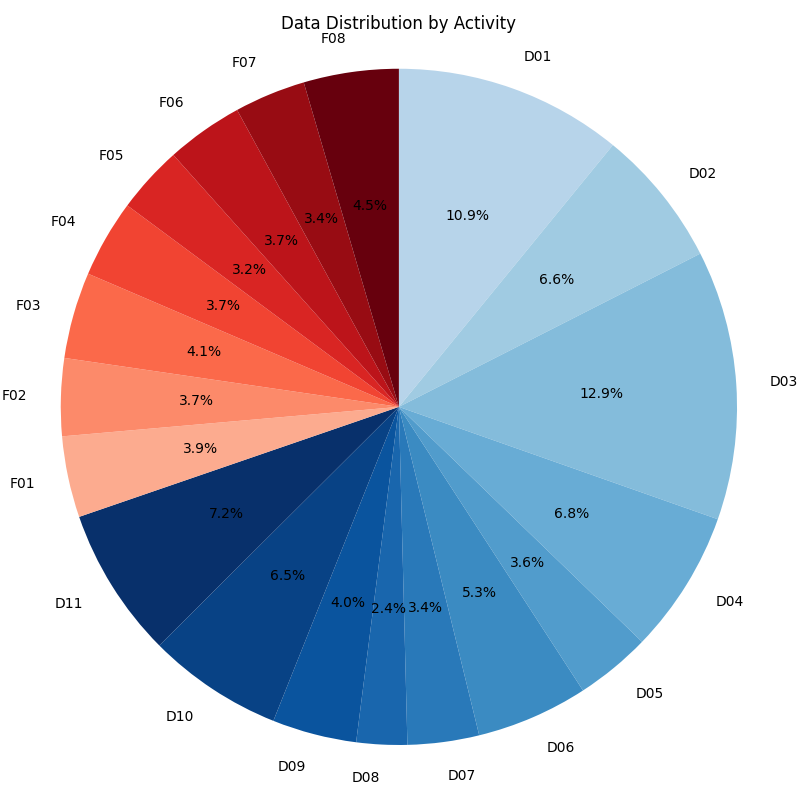
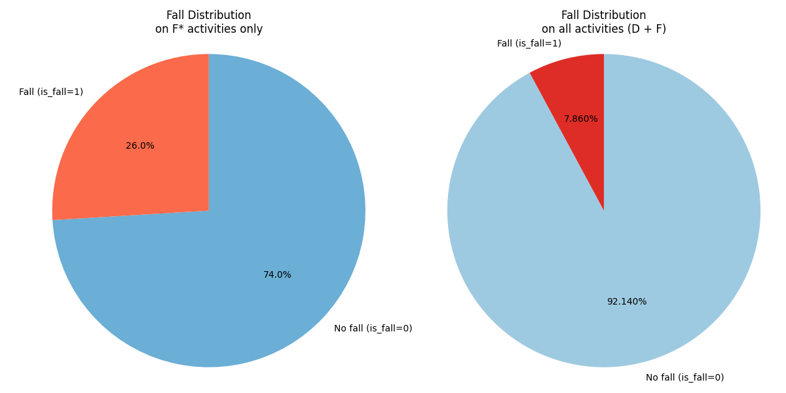
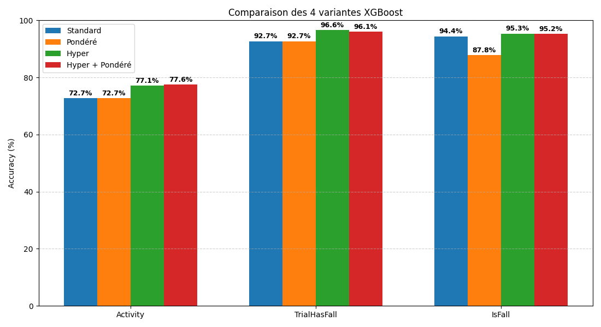
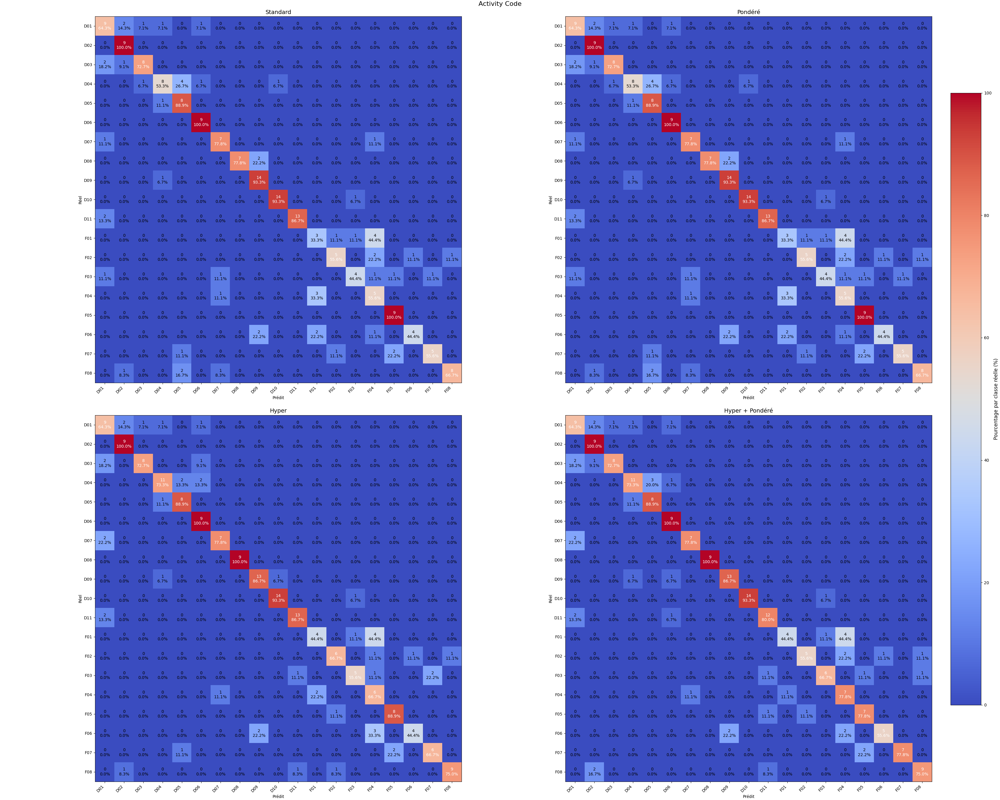
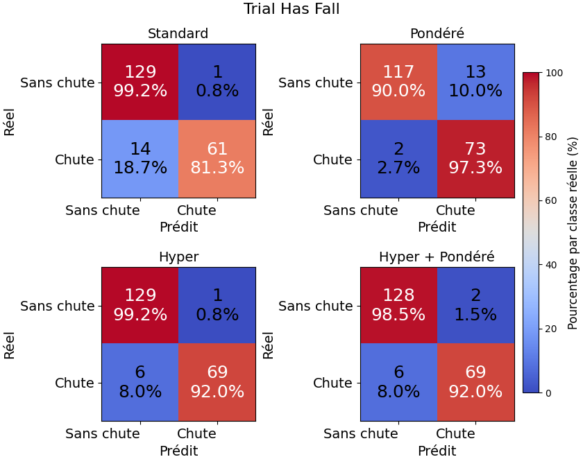

# WEDA-FALL

---

## 1. Configuration de l’environnement

Si vous ne disposez pas d’un GPU, vous pouvez exécuter le code sur CPU en configurant un environnement virtuel Python.

Cependant, si vous souhaitez utiliser votre GPU afin de gagner du temps, il est recommandé de configurer un
environnement **Conda**.

Quel que soit l’environnement que vous utilisez, installez toutes les librairies listées dans le fichier :  
`/WEDA-FALL/requirements.txt`

Veuillez utiliser Python `3.11`.

---

## 2. Préparation du dataset

Afin de préparer le dataset pour qu’il puisse être utilisé par les modèles d’IA, vous devez suivre le protocole
suivant :

### 2.1 Concaténation des données

Le dataset étant réparti sur `3 720 fichiers`, il est impératif de concaténer toutes les données dans un **seul fichier
unique**.  
Pour concaténer l’ensemble des fichiers, exécutez le script :

`merge_dataset_WEDA.py`

### 2.2 Interpolation des données

La concaténation produit un grand nombre de valeurs `NULL` dans le dataset à cause des décalages entre les différents
`timestamps`
d’enregistrement. Il est donc nécessaire d’interpoler les données manquantes plutôt que de supprimer les lignes
contenant des valeurs `NULL`.

Pour cela, exécutez le script :

`interpolation.py`

### 2.3 Répartition des données (train / test)

Une fois les données interpolées, il faut diviser le dataset en deux ensembles :

- **80 %** pour l’entraînement des modèles
- **20 %** pour les tests

Pour effectuer cette séparation, exécutez :

`split_dataset.py`

### 2.4 Statistiques des données

Afin d’obtenir des statistiques globales sur le dataset, exécutez le script :

`dataset_stats.py`

Vous obtiendrez alors les deux graphiques suivants :

---

## 3. Entraînement des modèles

Afin d’obtenir les meilleures performances possibles, l’algorithme **XGBoost** a été utilisé. Plusieurs stratégies ont
été mises en place
pour améliorer les résultats.

### 3.1 Entraînement de base

Dans un premier temps, des modèles XGBoost standards ont été entraînés.  
Pour cela, exécutez :

`train_models.py`

### 3.2 Pondération des données

Suite à des résultats peu convaincants, une pondération des classes a été mise en place pour compenser la
sous-représentation des chutes
dans le dataset.

Cela a permis d’entraîner des modèles prenant en compte ce déséquilibre de classes.  
Cette approche est implémentée dans le fichier :

`train_models.py`

### 3.3 Recherche d’hyperparamètres

Afin d’améliorer davantage les performances, nous avons utilisé **Optuna** pour rechercher automatiquement les meilleurs
hyperparamètres.

Pour cela, exécutez :

`train_models_hyper.py`

### 3.4 Tests des modèles

Une fois les modèles entraînés, il est nécessaire de les évaluer.  
Pour cela, exécutez :

`tests_models.py`

### 3.5 Analyse des résultats

Trois catégories de modèles ont été créées :

- **Détection fine de l’activité (`Activity`)**
    - Ce modèle vise à identifier précisément l’activité effectuée lors de l’enregistrement.
- **Détection globale de chute (`TrialHasFall`)**
    - Ce modèle détermine si un enregistrement contient au moins une chute.
- **Détection fine de chute (`IsFall`)**
    - Ce modèle vérifie pour chaque instant si une chute a lieu.

Le modèle `Activity` obtient des performances relativement faibles :

- `72.7 %` avec le modèle de base
- `77.6 %` avec pondération + hyperparamètres

Le modèle `TrialHasFall` obtient :

- `92.7 %` avec XGBoost standard
- `96.6 %` après optimisation par hyperparamètres

On observe néanmoins une légère dégradation des performances lorsqu’on combine la pondération et l’optimisation
des hyperparamètres.

Le modèle `IsFall` obtient des scores élevés dans tous les cas, mais une analyse plus fine est nécessaire.

Pour le modèle `Activity`, l’optimisation par hyperparamètres et la pondération permettent de réduire les faux positifs
et les faux négatifs, améliorant la stabilité globale.

Le modèle `TrialHasFall` conserve un faible taux de faux positifs (<10 %).  
La pondération augmente légèrement les faux positifs mais réduit fortement les faux négatifs.

Cependant, l’équilibre optimal semble être atteint avec le modèle utilisant uniquement les hyperparamètres.

Le modèle `IsFall` présente la plus forte amélioration :

- Modèle de base : faux négatifs à `58.3 %`
- Pondération seule : réduit à `12.1 %`
- Hyperparamètres seuls : réduit à `38 %`
- Pondération + hyperparamètres : `32 %`

Le meilleur compromis est atteint avec **la pondération seule**, avec :

- Faux positifs ≈ `12 %`
- Faux négatifs ≈ `12 %`

Ce qui constitue un très bon résultat pour une détection fine instantanée de chute.

### 3.6 Modèles d'ensembles :

Voting et Stacking (à venir)